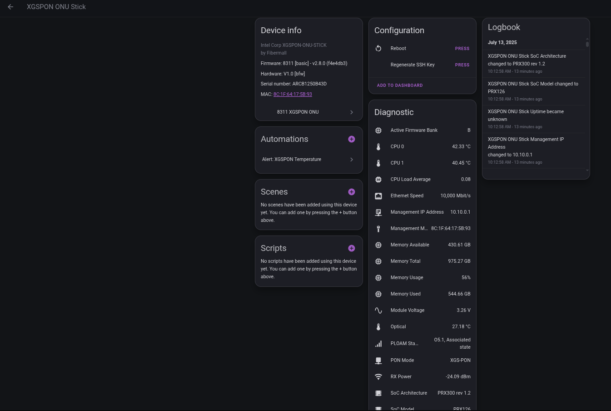

# 8311 XGS-PON ONU SSH Exporter Integration


[](https://github.com/custom-components/hacs)

A Home Assistant integration for monitoring and controlling [8311 Firmware](https://github.com/djGrrr/8311-was-110-firmware-builder) 
flashed __XGS-PON ONU__ / __WAS-110__ ONU SFP+ sticks via __SSH__.

## Features

- **Real-time Monitoring**: Monitor temperature, optical power, voltage, and other critical parameters
- **System Information**: Get detailed system information including uptime, memory usage, and CPU load
- **Remote Control**: Reboot the ONU stick remotely
- **SSH Key Management**: Automatic SSH key generation and management (on the HASS client)
- **Configurable Polling**: Adjustable data update intervals
- **Comprehensive Sensors**: 20+ sensors covering all aspects of ONU operation and information (including SoC)

## Installation

### HACS (Recommended)

1. Make sure you have [HACS](https://hacs.xyz/) installed
2. Add this repository to HACS:
   - Go to HACS → Integrations
   - Add this repository to HACS as an integration
   - Search for "8311"
   - Click "Download"
3. Restart Home Assistant
4. Go to Settings → Devices & Services
5. Click "Add Integration"
6. Search for "8311"

### Manual Installation

1. Download the `custom_components/8311_onu_stick` folder
2. Copy it to your Home Assistant `custom_components` directory
3. Restart Home Assistant
4. Go to Settings → Devices & Services
5. Click "Add Integration"
6. Search for "8311"

## Configuration

### Prerequisites

- SSH access to your ONU stick
- SSH username
- ONU stick IP address

### Setup Process

1. **Add Integration**: Go to Settings → Devices & Services → Add Integration
2. **Enter Details**: Provide the ONU host IP, SSH username, ONU Manuifacturer (Fibermall, ECNI, etc.)
3. **SSH Key Setup**: The integration will automatically generate a SSH key and show it to you during configuration
4. **Add Public Key**: Copy the generated public key to your ONU stick's SSH key management
5. **Test Connection**: The integration will test the SSH connection
6. **Complete Setup**: Once verified, the integration will start monitoring

### SSH Key Management

The integration automatically generates and manages SSH keys for secure communication. The public key will be displayed during setup and needs to be added to your ONU stick's SSH key management interface. There is also a `SSH Public Key` sensor that has the public key as an attribute.

**Location on ONU**: System → Administration → SSH-Keys

## Services

### reboot_onu_stick
Reboots the ONU stick device using SSH and `reboot`

### regenerate_ssh_key
Generates a new client SSH key to connect to the ONU stick (backs up the current key with a timestamp in the filename).

## Buttons

- **Reboot**: Reboots the ONU stick using the exposed service/action
- **Regenerate SSH Key**: Generates a new SSH key using the exposed service/action

## Configuration Options

- **Data Update Interval**: Configure how often sensor data is fetched (30 seconds to 1 hour)

## Troubleshooting

### Common Issues

1. **SSH Connection Failed**
   - Verify the ONU IP address is correct
   - Ensure SSH is enabled on the ONU
   - Check that the SSH key was properly added

2. **Authentication Failed**
   - Verify the SSH username is correct
   - Ensure the public key was added to the ONU's SSH key management
   - Try regenerating the SSH key

3. **Sensors Not Updating**
   - Check the data update interval in integration options
   - Verify SSH connectivity
   - Check Home Assistant logs for errors

### Logs

Enable debug logging by adding to your `configuration.yaml`:

```yaml
logger:
  default: info
  logs:
    custom_components.8311_onu_stick: debug
``` 

## Security ('Trust, but verify')
The SSH command is in the [coordinator.py](./custom_components/8311_onu_stick/coordinator.py) file. It is a single SSH command chained together, with boundarys, in order to parse the output of several commands that the data is pulled from. The reason for a single chained together command is for efficency. If we issue one command, disconnect and re-connect for each command, there is a substantial delay.

You can view the __debug__ logs to see what commands are being executed:
```log
Commands to execute: ['pon psg', 'cat /sys/class/thermal/thermal_zone0/temp', 'cat /sys/class/thermal/thermal_zone1/temp', 'xxd -p /sys/class/pon_mbox/pon_mbox0/device/eeprom50', 'xxd -p /sys/class/pon_mbox/pon_mbox0/device/eeprom51', 'cat /sys/class/net/eth0_0/speed', 'uci get gpon.ponip.pon_mode', '. /lib/8311.sh && get_8311_module_type', '. /lib/8311.sh && active_fwbank', 'uptime', 'free -m', 'cat /proc/cpuinfo', 'cat /etc/8311_version', '. /lib/8311.sh && get_8311_lct_mac', '. /lib/8311.sh && get_8311_gpon_sn']
```

Please review [coordinator.py](./custom_components/8311_onu_stick/coordinator.py) for your own peace of mind.

## Example Device Info View


### Why so many sensors?
For all the data points to make neat cards like this:


The [card YAML](./examples/ring-tile.yaml) uses:
- card-mod (HACS)
- layout-card (HACS)
- [ring-tile](https://github.com/neponn/ring-tile-card)
- vertical-stack-in-card (HACS)
- mushroom-template-card (HACS)
- mini-graph-card (HACS)

I did not dial in the color gradients for the ring-tile or mini-graph cards, so you may want to adjust to your liking.

# License

[MIT](./LICENSE)